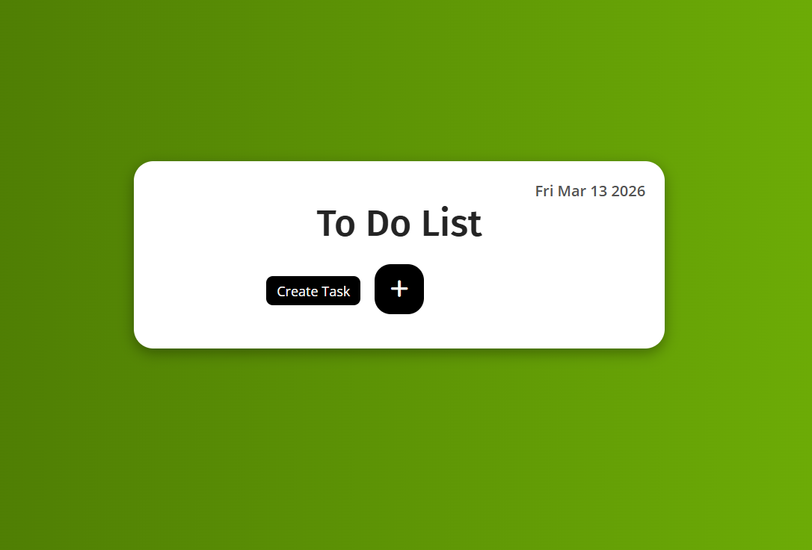
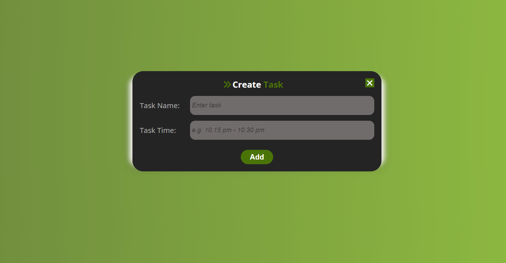
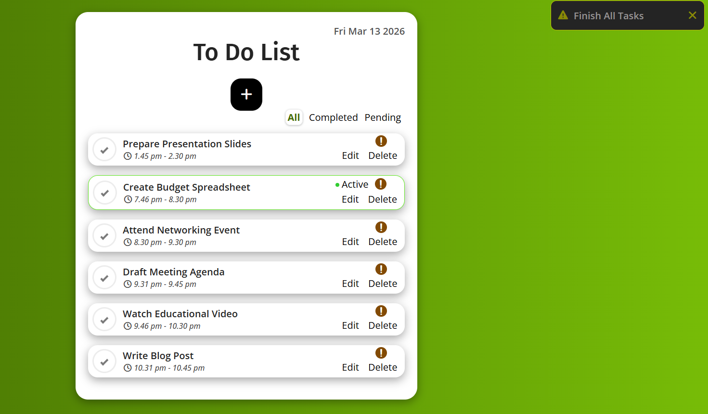
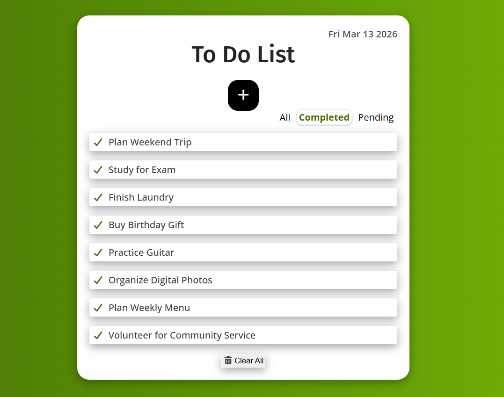
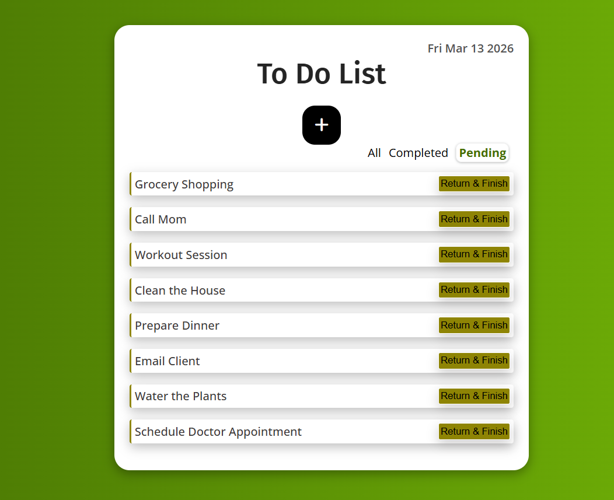

# To-Do List Web Application
A stylish, responsive, and feature-rich To-Do List web application built with HTML, CSS, and JavaScript. Effortlessly manage daily tasks with features such as task creation, editing, deletion, completion tracking, pending task management, notification alerts, time-based activity detection, and LocalStorage persistence.

## Features 
* Create, edit, and delete tasks
* Mark tasks as completed
* Move tasks to pending
* Return pending tasks back to active tasks
* Clear completed tasks option
* View all, completed, and pending tasks with tab navigation
* Real-time active task indicator based on current time
* Local storage to save and restore tasks
* User-friendly UI with smooth animations and a responsive design.

## Demo 


## Deployment
This project is hosted on multiple platforms:
* **GitHub Pages:** [View Demo](https://athira-rkrishnan.github.io/javascript-todo-list-app/)
* **Netlify:**  [View Demo](https://javascript-todo-list-app-ak26.netlify.app/)
* **Vercel:**  [View Demo](https://javascript-todo-list-app.vercel.app/)

## Screenshots

<table align="center">
<tr>
<td align="center">
<h4>Main Page</h4>
<a href="assets/Main-Page.png">
    
</a>
</td>
<td align="center">
<h4>Create Task Popup</h4>
<a href="assets/CreateTask-Popup.png">
    
</a>
</td>
</tr>

<tr>
<td align="center">
<h4>All Tasks</h4>
<a href="assets/All-Tasks-MainPage.png">
    
</a>
</td>
<td align="center">
<h4>Completed Tasks</h4>
<a href="assets/CompletedTasks.png">
    
</a>
</td>
</tr>

<tr>
<td align="center">
<h4>Pending Tasks</h4>
<a href="assets/PendingTasks.png">
    
</a>
</td>
<td></td>
</tr>
</table>

## Technologies Used
* HTML5
* CSS3
* JavaScript
* LocalStorage API
* Font Awesome Icons

## How It Works
### 1. Task Creation
Users can create tasks by entering:
- **Task Name**
- **Task Time Range**
Example: 10.15 pm - 10.30 pm

### 2. Active Task Detection
The app automatically checks the **current time** and determines whether a task is active.
Active tasks are highlighted with:
- Green border
- "Active" indicator

### 3. Task Completion
When a task checkbox is selected:
- The task moves to the **Completed section**
- A maximum of **8 completed tasks** are allowed
- If exceeded, the user must clear completed tasks

### 4. Pending Tasks
Tasks can be moved to the **Pending section** if they are not completed.
Pending tasks can later be:
- Returned to the main list
- Completed normally

### 5. Data Persistence
All tasks are stored in **LocalStorage**, so:
- Tasks remain even after refreshing the page
- Tabs and completed/pending states are preserved

## Key JavaScript Concepts Used
- DOM Manipulation
- Event Delegation
- LocalStorage
- Regex for Time Parsing
- Dynamic HTML Rendering
- Conditional UI Logic

## Future Improvements
- Drag & Drop task sorting
- Due Dates & Priority
- Task progress tracker
- Dark / Light mode toggle
- Backend database integration

## Installation
1. Clone the repository:
```
 https://github.com/athira-rkrishnan/javascript-todo-list-app.git
```
2. Open **index.html** in your browser.

3. Click the **"+"** button to add new tasks, or edit existing ones.

## License 
This project is open-source and available under the MIT License.

## Contact 
For questions or suggestions, please contact Athira Radhakrishnan at athirarkrishnan25@gmail.com.

⭐ If you like this project, feel free to **star the repository**!